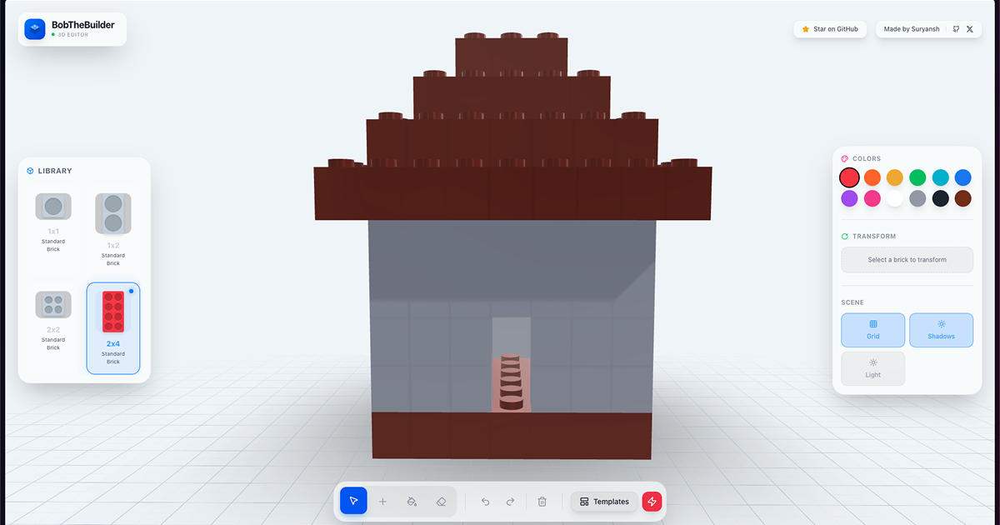

# BobTheBuilder 🏗️



A modern, interactive 3D brick building experience built with the power of the web. Design, build, and unleash your creativity in a browser-based LEGO-style editor.

**[Live Demo](https://bob-the-builder-kappa.vercel.app/)**

## ✨ Features

- **Immersive 3D Environment**: Built with React Three Fiber for high-performance WebGL rendering.
- **Smart Snapping & Stacking**: Intuitive placement system that snaps bricks to the grid and stacks them correctly (stud-to-stud).
- **Modern UI**: A sleek, glassmorphism-inspired interface designed for accessibility and ease of use.
- **Essential Tools**:
  - **Add**: Place bricks with a real-time "ghost" preview.
  - **Select**: Modify existing bricks.
  - **Paint**: Recolor your creations instantly.
  - **Erase**: Remove mistakes with a click.
- **Customization**:
  - Rotate bricks 90 degrees.
  - Choose from a vibrant palette of colors.
  - Toggle grid and shadows for the perfect view.
- **History**: Full Undo/Redo support to experiment without fear.

## 🎮 Controls

| Action                   | Input                                             |
| :----------------------- | :------------------------------------------------ |
| **Place / Select / Act** | Left Click                                        |
| **Rotate Camera**        | Right Click + Drag                                |
| **Pan Camera**           | Middle Click + Drag (or Shift + Click + Drag)     |
| **Zoom**                 | Mouse Wheel / Pinch                               |
| **Tools Shortcuts**      | `V` (Select), `A` (Add), `B` (Paint), `E` (Erase) |

## 🛠️ Tech Stack

- **Framework**: [Next.js 15](https://nextjs.org/) (App Router)
- **3D Engine**: [React Three Fiber](https://docs.pmnd.rs/react-three-fiber) (Three.js)
- **State Management**: [Zustand](https://zustand-demo.pmnd.rs/)
- **Styling**: [Tailwind CSS](https://tailwindcss.com/)
- **Icons**: [Lucide React](https://lucide.dev/)
- **Font**: [Plus Jakarta Sans](https://fonts.google.com/specimen/Plus+Jakarta+Sans)

## 🚀 Getting Started

1. **Clone the repository**:

   ```bash
   git clone https://github.com/yourusername/bob-the-builder.git
   cd bob-the-builder
   ```

2. **Install dependencies**:

   ```bash
   npm install
   ```

3. **Run the development server**:

   ```bash
   npm run dev
   ```

4. **Open in browser**:
   Navigate to [http://localhost:3000](http://localhost:3000).

## 👨‍💻 Author

**Suryansh Chourasia**

- [GitHub](https://github.com/suryansh777777)
- [X (Twitter)](https://x.com/suryansh777777)

## 📄 License

This project is open source and available under the [MIT License](LICENSE).
